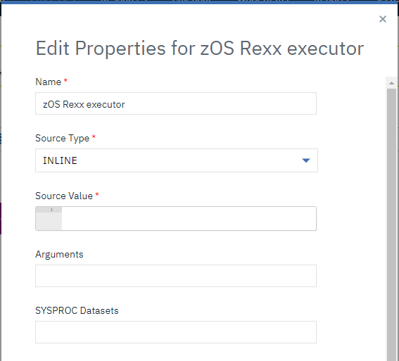
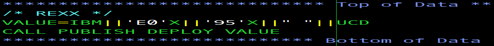
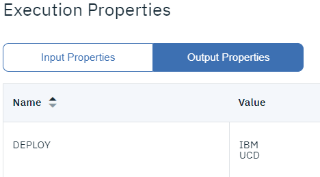
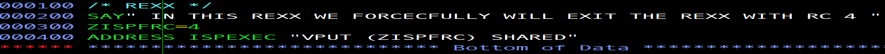

# z/OS Rexx Executor - Usage

---

The z/OS Rexx Executor plug-in will execute statements provided in a dataset or inline in the plugin step. 

## Executing the REXX plugin 

The plugin accepts various inputs in the following fields

### SourceType as DATASET

Select **Source type** as DATASET from the drop-down and enter the dataset in the **Source Value**. The dataset if fully qualified needs to be enclosed in single quotes.
When the quotes are omitted then, the TSO prefix of the id running the plugin step is prefixed to the Source Dataset.  

### SourceType as INLINE

When **INLINE** is selected as  **SourceType** dropdown, then **Source Value** should be filled with REXX statements beginning with a **/\* REXX \*/**. 

### Arguments and SYSPROC datasets

Arguments can be issued to the REXX program with/without quotes. However, if there is more than 1 argument then they have to be separated by spaces. 
The **SYSPROC** field allows user to input datasets that may contain other REXX programs that will be used by the REXX program run by the plugin step. Multiple **SYSPROC** datasets can be given to the input but must be
separated by comma. 

## Publishing output properties

This plugin allows user to publish output properties from the REXX statements and be used in successive steps of a process. A user REXX program can simply invoke a call to **PUBLISH** with 2 arguments.
the 1st argument is considered as the key (or) name of the property which is used in subsequent steps to refer to the property value. The 2nd argument is the value associated with the name of the property. Any further arguments are disregarded.
A user can call PUBLISH as many times in their REXX program with different keys and values to write as many properties. 

### Publishing multi-line properties
Property values can also be multiline. But for a multiline property, user has to specifically add 'end-of-Line' characters **'E0'X||'95'X** in the property value for the plugin to understand the end of line and continue in the next line.
For Eg:- For a property named  **Key** and a value, **'IBM ||'E0'X||'95'X|| UCD'** will result in IBM and UCD printed in successive lines.

The output properties after execution can be seen as below

### Referring properties from successive steps

The output properties published by this plugin can be referred by the successive steps by referring to the step name of the **Rexx Executor plugin** and property name in the format as shown below 

**${p:step-name/property-name}**

## Error handling 

A failure in REXX statement doesn't automatically fail the plugin step. The REXX plugin uses ISPF gateway to invoke REXX statements and hence, it looks for the return code set against ISPF variable "ZISPFRC". 
Inorder to fail the plugin, set the ZISPFRC to 4 or higher LIKE BELOW

The plugin step copies the data from a PDS member or input Sequential dataset to the Output Sequential dataset.

|          Back to ...          |                                |                                                                   Latest Version                                                                    | z/OS Dataset Writer ||||
|:-----------------------------:|:------------------------------:|:---------------------------------------------------------------------------------------------------------------------------------------------------:|:-------------------:| :---: | :---: | :---: |
| [All Plugins](../../index.md) | [Deploy Plugins](../README.md) | [4.1138411](https://raw.githubusercontent.com/UrbanCode/IBM-UCD-PLUGINS/main/files/zos-dataset-writer/ucd-plugins-zos-dataset-writer-4.1138411.zip) | [Readme](README.md) |[Overview](overview.md)|[Steps](steps.md)|[Downloads](downloads.md)|
