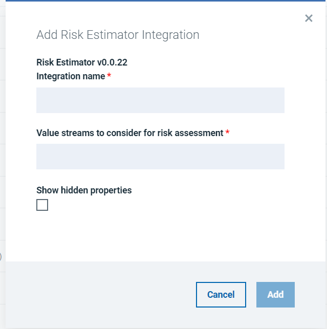
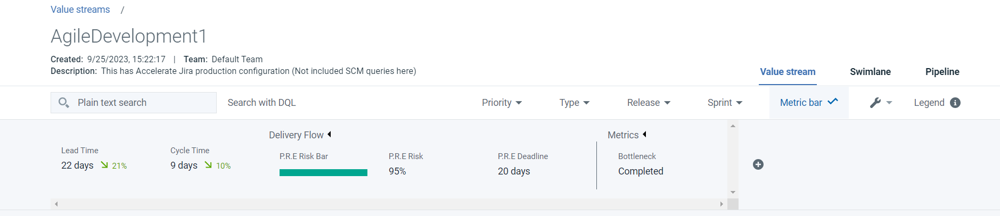
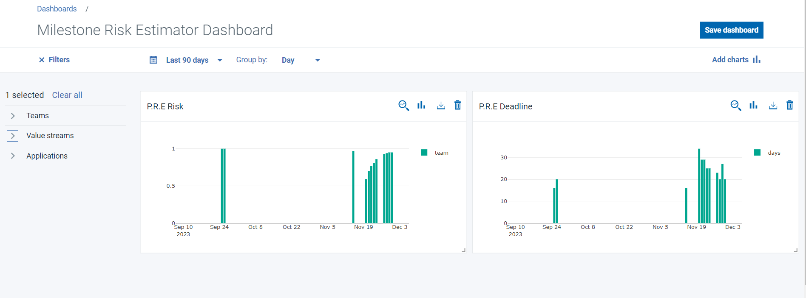

# Milestone Risk Estimator - Usage

To use the Milestone Risk Estimator plugin, the plugin must be loaded and an instance created before you can configure the plugin integration. You define configuration properties in the user interface.

## Integration Type

The Milestone Risk Estimator plugin supports scheduled events integration which are listed in the following table.

| Name | Description |
| --- | --- |
| ExecuteTrain | Probabilistic Estimator Training |
| ExecutePredict | Probabilistic Estimator Predictor |

## Integration

The tables in the Configuration properties topic describe the properties used to define the integration.

### Using the user interface

1. In Urbancode Velocity, click **Settings** > **Integrations** > **Available**.
2. In **Available** plugins list, under the **Action** column for the plugin, click **Add Integration**.
3. On the Add Integration page enter values for the fields used to configure the integration and define communication.
4. Click **Add/Save**.

## Metrics Result In VSM

Once the Milestone Risk Estimator plugin has been executed successfully, it is possible to observe results through dedicated metrics.

1. In Urbancode Velocity click on **Value Streams**, click on required Value Stream
2. Click on **Metric Bar**, Click on **+** button.
3. Select from category **Delivery Flow**, **P.R.E Risk** (shows the evaluated risk as percentage) and **P.R.E Deadline** (shows an estimated deadline).

## Metrics Result In Insights

To view metrics result in insights page follow bellow steps.

1. In Urbancode Velocity click on **Insights**
2. Click on **Create Dashboard**, create your own dashboard with any name
3. Select created dashboard and click on **Add Charts** at top right of the page
4. Select from category **Delivery Flow**, **P.R.E Risk** (shows the evaluated risk as percentage) and **P.R.E Deadline** (shows an estimated deadline), Click on **Add** button.
5. To view data for perticular value stream left side click on drop down **Value Stream**, select required Value stream.

## Configuration Properties

The following tables describe the properties used to configure the integration. Each table contains the field name when using the user interface and the property name.

* The General Configuration Properties table describes configuration properties used by all plugin integrations.
* The Milestone Risk Estimator Configuration Properties table describes the configuration properties that define the connection and communications with the Milestone Risk Estimator.

Some properties might not be displayed in the user interface, to see all properties enable the **Show Hidden Properties** field.

### General Configuration Properties

| Name | Description | Required | Property Name |
| --- | --- | --- | --- |
| NA | The version of the plugin that you want to use. To view available versions, click the Version History tab. If a value is not specified, the version named latest is used. | No | image |
| Integration Name | An assigned name to the value stream. | Yes | name |
| Logging Level | The level of Log4j messages to display in the log file. Valid values are: all, debug, info, warn, error, fatal, off, and trace. | No | loggingLevel |
| NA | List of plugin configuration properties used to connect and communicate with the milestone risk estimator. Enclose the properties within braces. | Yes | properties |
|  | The name of the tenant. | Yes | tenant_id |
| NA | Unique identifier assigned to the plugin.The value for the Milestone risk estimator plugin is ucv-ext-milestone-risk-estimator. | Yes | type |
| Devops Velocity User Access Key | An auto-generated user access key provides credentials for communicating with the Urbancode Velocity server. | Yes | NA |

### Milestone Risk Estimator Configuration Properties

| Name | Type | Description | Required | Property Name |
| --- | --- | --- | --- | --- |
| Value streams to consider for risk assessment | Array | Provide a set of value stream names comma separated, to be considered for training/prediction (i.e: Vsm_Name1,Vsm_Name2 ) | Yes | vsmsArray |

|Back to ...||Latest Version|Milestone Risk Estimator |||
| :---: | :---: | :---: | :---: | :---: | :---: |
|[All Plugins](../../index.md)|[Velocity Plugins](../README.md)|[1.0.1](https://hub.docker.com/r/urbancode/ucv-ext-milestone-risk-estimator/tags)|[Readme](README.md)|[Overview](overview.md)|[Downloads](downloads.md)|